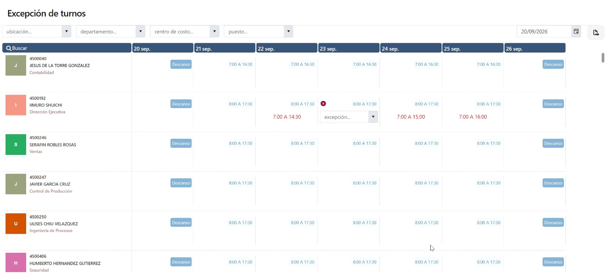

# Excepción de turnos

Esta pantalla permite asignar cambios puntuales de turno a los empleados durante una semana específica.

> **Nota**
>
> La excepción de turno aplica únicamente para el día seleccionado y no modifica la rotación habitual del empleado.

## ¿Para qué sirve?

Sirve para cambiar el turno de un empleado en una fecha específica, cuando por operación necesita trabajar en un horario distinto al programado originalmente.

## ¿Cómo se utiliza?

Selecciona la semana a consultar, busca al empleado y elige el día en el que se requiere aplicar la excepción de turno.

Desde la vista semanal puedes identificar rápidamente los turnos asignados, descansos y horarios programados para cada empleado.

## Reporte

La pantalla permite generar un reporte en **PDF** con la información de la semana consultada.

## Consideraciones

Los cambios realizados pueden impactar el cálculo de asistencia, incidencias, retardos, faltas u horas extra, dependiendo de las reglas configuradas para la empresa.

---

Versión 1.0 · Última actualización: Agosto 2026